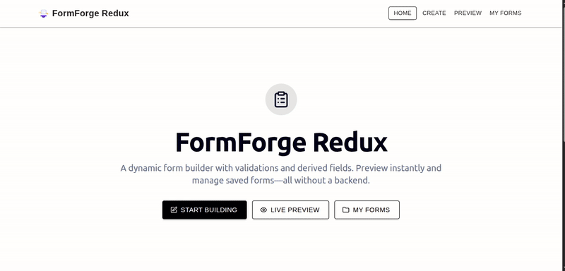

# FormForge Redux

<p align="left">
  
  
  
  
</p>

A dynamic, interactive form builder built with React, TypeScript, and MUI. Instantly create, preview, and manage forms—no backend required!

---

## 🎬 Demo

Here's a quick look at FormForge Redux in action. This demonstrates creating a form, adding various fields, configuring a derived field, and previewing the live validation.



---

## Contents
- [FormForge Redux](#formforge-redux)
  - [🎬 Demo](#-demo)
  - [Contents](#contents)
  - [ Objective](#-objective)
  - [ Features](#-features)
  - [Routes](#routes)
  - [Getting Started](#getting-started)
  - [Usage](#usage)
    - [1. Form Builder (`/create`)](#1-form-builder-create)
    - [2. Preview (`/preview`)](#2-preview-preview)
    - [3. My Forms (`/myforms`)](#3-my-forms-myforms)

---

##  Objective
A dynamic form builder built using React, Typescript, MUI, and localStorage. Users can:
-  Create dynamic forms with customizable fields and validations
-  Preview forms as an end user
-  View and manage saved forms
-  Persist all form configurations in localStorage (no backend required)

---

##  Features
-  **Dynamic Fields**: Add Text, Number, Textarea, Select, Radio, Checkbox, Date fields
-  **Field Configuration**: Set label, required, default value, and validation rules (min/max length, email, password)
-  **Derived Fields**: Compute values based on other fields (e.g., Age from Date of Birth)
-  **Live Preview**: Instantly see and interact with your form as an end user
-  **Validation**: Real-time validation and error messages
-  **Reorder/Delete Fields**: Drag to reorder, remove fields easily
-  **LocalStorage Persistence**: All form schemas are saved locally

---

## Routes
| Route         | Description                                      |
|-------------- |--------------------------------------------------|
| `/create`     | Build a new form by adding/configuring fields     |
| `/preview`    | Interact with the currently built form           |
| `/myforms`    | View all saved forms from localStorage           |

---

## Getting Started
1. **Clone the repo:**
   
   ```bash
    git clone git@github.com:RoystonDAlmeida/formforge-redux-form-builder.git
    cd formforge-redux-form-builder/
   ```

2. **Install dependencies:**
   
   ```bash
   npm install
   ```

3. **Run the app:**
   
   ```bash
   npm run dev
   ```
4. **Open in browser:**
   Visit [http://localhost:8080](http://localhost:8080)

---

## Usage
### 1. Form Builder (`/create`)
- Add fields: Text, Number, Textarea, Select, Radio, Checkbox, Date
- Configure each field: label, required, default, validation rules
- Mark fields as Derived: select parent fields, define formula/logic
- Reorder or delete fields
- Save form: name your form, schema saved in localStorage

### 2. Preview (`/preview`)
- See the form as an end user
- All fields support input and validation
- Derived fields auto-update as parents change

### 3. My Forms (`/myforms`)
- List all saved forms (name, creation date)
- Click a form to open and manage it